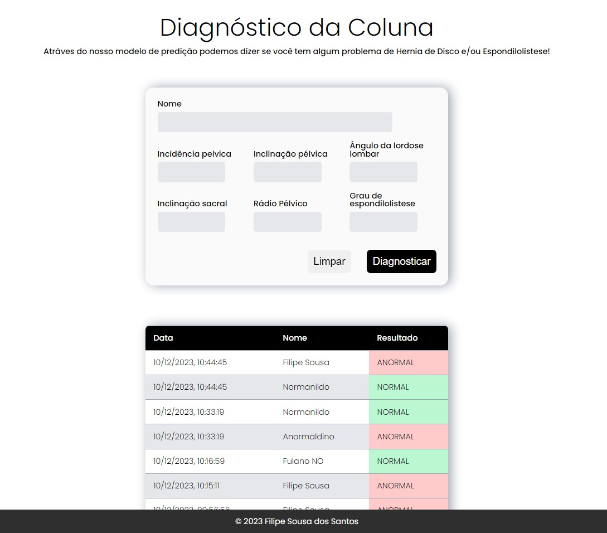

# Diagnóstico da Coluna

A **Diagnóstico da Coluna** é uma aplicação que faz uma predição que diz se um paciente tem ou não algum problema de Hernia de Disco ou Espondilolistese..

Principais funcionalidades:
- **Cadastro de paciente**: cadastro do paciente que com base nos dados passados a platadorma informa o diagnóstico;
- **Listagem dos pacientes**:lista os pacientes com seus respectivos resultados;

---
## Tecnologias
- **HTML**: linguagem de marcação para a criação da página;
- **CSS**: estilização da pagina;
- **JavaScript**: iteração e consumo dos recursos da API.

---
## Execução da aplicação

Basta copiar o endereço (path) do arquivo `index.hmtl` e colar na barra de navegação de qualuer navegador.
